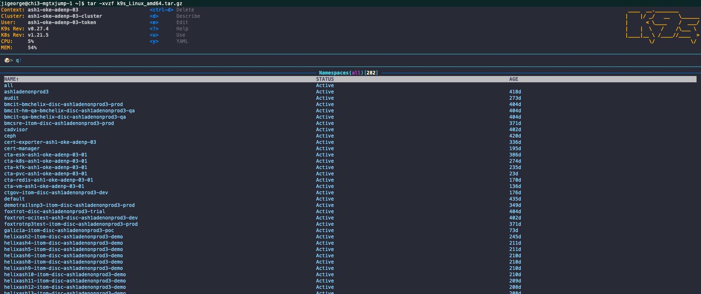

## Installation Steps
### Reference Site

https://k9scli.io/topics/commands/

```
[jigeorge@chi3-mgtxjump-1 ~]$ wget https://github.com/derailed/k9s/releases/download/v0.27.4/k9s_Linux_amd64.tar.gz

[jigeorge@chi3-mgtxjump-1 ~]$ tar -xvzf k9s_Linux_amd64.tar.gz

[jigeorge@chi3-mgtxjump-1 ~]$ sudo cp k9s /usr/local/bin

[jigeorge@chi3-mgtxjump-1 ~]$ which k9s

[jigeorge@chi3-mgtxjump-1 ~]$ ls -l /usr/local/bin/k9s
-rwxr-xr-x. 1 root root 60559360 Oct  7 00:18 /usr/local/bin/k9s

[jigeorge@chi3-mgtxjump-1 ~]$ k9s

```



### Some handy command

:pod :namespace --- To get resource from a resource group

Check pod with the specific label
: -l app=prod

:popeye

shift + m --> sort by memory
shift + c --> sort by cpu
shift + s --> sort by status
shift + s --> sort by age


### List all available CLI options
k9s help
### Get info about K9s runtime (logs, configs, etc..)
k9s info
### Run K9s in a given namespace.
k9s -n mycoolns
### Run K9s and launch in pod view via the pod command.
k9s -c pod
### Start K9s in a non default KubeConfig context
k9s --context coolCtx
### Start K9s in readonly mode - with all modification commands disabled
k9s --readonly


