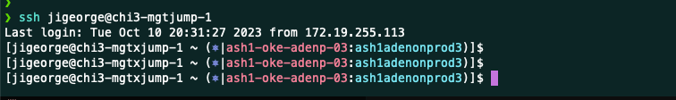

https://github.com/jonmosco/kube-ps1#from-source


git clone https://github.com/jonmosco/kube-ps1.git

#### BASH
```
source /home/onbmc.com/jigeorge/kube-ps1/kube-ps1.sh
PS1='[\u@\h \W $(kube_ps1)]\$ '

```



#### ZSH
```
source /home/onbmc.com/jigeorge/kube-ps1/kube-ps1.sh
PROMPT='$(kube_ps1)'$PROMPT # or RPROMPT='$(kube_ps1)'
```
